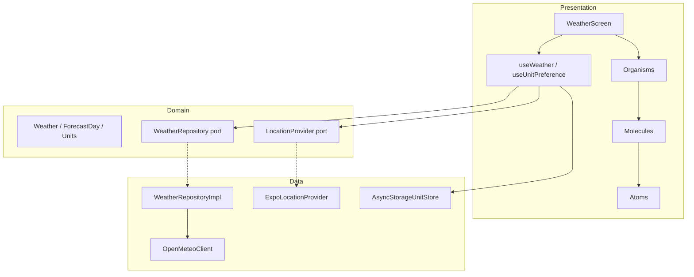

# Architecture

Horizon Weather separates concerns into three Clean Architecture layers, with Atomic Design organizing the presentation UI.

## Layer diagram

## Legend

### Presentation

Screens, hooks, and UI components. Fetching logic lives in hooks — components only render state and forward user actions.

- **Screens** — `WeatherScreen` wires hooks to the template
- **Templates** — layout slots (header, controls, content) with pull-to-refresh
- **Organisms** — `CurrentConditions`, `ForecastSection`, banners
- **Molecules** — `UnitToggle`, `DayRangeSelector`, metric rows
- **Atoms** — `AppText`, `TemperatureText`, `LoadingSpinner`
- **Hooks** — `useWeather` (geo → repository, race guard via `performWeatherFetch`), `useUnitPreference` (persisted units)

### Domain

Pure TypeScript — no React or platform imports.

- **Entities** — `CurrentWeather`, `ForecastDay`, `WeatherBundle`, `TemperatureUnit`
- **Ports** — `WeatherRepository`, `LocationProvider` interfaces

### Data

Concrete implementations of domain ports and external integrations.

- **OpenMeteoClient** — single HTTP call for current + daily forecast
- **WeatherRepositoryImpl** — delegates to Open-Meteo mapper
- **ExpoLocationProvider** — permission request, geocode, Manila fallback
- **AsyncStorageUnitStore** — persists °C/°F preference

## Data flow

1. `WeatherScreen` mounts → `useWeather` calls `refresh()`
2. `ExpoLocationProvider` resolves coordinates (or fallback)
3. `OpenMeteoClient` fetches weather in one request
4. Mapper converts DTO → domain entities
5. Hook applies result only if its request ID is still latest
6. Presentation components render domain data with unit conversion in the view layer

## Stale-safe refresh

Rapid pull-to-refresh or changing forecast day count can trigger overlapping requests. `useWeather` assigns a monotonic request ID to each refresh and discards responses whose ID is older than the latest — preventing stale data from overwriting fresh results.

See `src/presentation/hooks/requestGuard.ts`, `src/presentation/hooks/performWeatherFetch.ts`, and `__tests__/performWeatherFetch.test.ts`.
